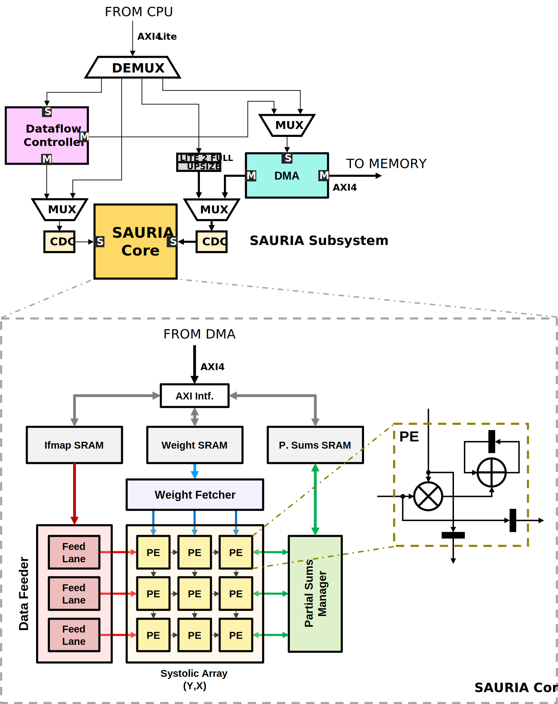

# Sauria Systolic Array Accelerator – Verification Environment

UVM-based functional verification of a systolic-array–based compute accelerator, with focus on tile management, dataflow orchestration, compute sequencing, and array-level execution behavior.

This verification environment uses the original Sauria architecture and RTL strictly as the design under test. All other components of the upstream repository, including any software stack, testing framework, or system-level integration harness, are intentionally excluded.

The goal is to develop a reusable, IP-level verification environment for validating tiled execution behavior and control-driven compute sequencing, while remaining focused on the architectural blocks that define correct operation.

The environment is structured around production-quality UVM practices, including modular agents, targeted stimulus, functional coverage, and assertion-based checking.

The verification architecture is intentionally modular, enabling incremental expansion or integration without structural redesign.

---

## Verification Highlights

Key aspects of the verification effort include:

- Model-driven verification of tiled tensor execution using architectural tile traversal models
- Domain-specific scoreboards validating control sequencing and array-level compute behavior
- Assertion-based verification of control-path invariants and execution completion guarantees
- Directed and constrained-random stimulus targeting tile geometry, boundary conditions, and control transitions
- Functional coverage tracking tile progression scenarios and execution corner cases
- Full subsystem instantiation enabling validation of control, data movement, and array execution interactions

---

## Architecture

<p align="center">
  
</p>

###### Author: Jordi Fornt Mas (jordi.fornt@bsc.es)

### Control Overview

Sauria is configured, controlled, and exchanges data primarily through AXI-based interfaces. AXI4-Lite is used for configuration and control register access, while AXI4 is used for bulk data movement. These interfaces form the primary mechanism for communication both into the Sauria subsystem and between major architectural blocks within the design.

Sauria is organized around a systolic array compute core controlled through a two-level control hierarchy:

* A **top-level dataflow controller** responsible for tensor-level configuration, tile management, and operation launch
* A **compute-core controller** responsible for sequencing compute phases within the core

The dataflow controller holds tensor dimensions, tile geometry, and tiling parameters, and generates per-tile metadata that is provided to the DMA engine for loading data into on-chip memories. 

The compute-core controller sequences array execution for each tile. Upon completion of the programmed operation, the compute core signals completion back to the dataflow controller.

### Verification Configuration (Instantiated Blocks)

The verification environment instantiates a complete Sauria subsystem, including all RTL blocks that form part of the accelerator architecture. While the full subsystem is present to preserve realistic control and dataflow interactions, verification remains focused on correctness of the accelerator IP rather than system-level integration or external interfaces.

Because the full subsystem is instantiated, verification requires reasoning across control, data movement, and partial-sum flow rather than isolated block-level checking.

At a high level, the instantiated blocks include:

* Top-level dataflow controller
* DMA engine
* Compute core, including:

  * Systolic array
  * Compute-core controller
  * Data feeder
  * Weight fetcher
  * Partial sums manager
  * Local SRAMs and associated local control logic

Blocks listed as out of scope are instantiated but treated as functionally abstracted or assumed-correct components, providing stimulus delivery and observability without being the primary targets of verification.

### Out of Scope Verification

- **DMA Engine and Memory Subsystem**
Verification of the DMA engine implementation, memory hierarchy behavior, and external memory interfaces is excluded. The DMA is treated as a consumer of tile-level metadata generated by the dataflow controller, and as a producer of data visible to the compute core, without attempting to validate memory correctness, performance, or protocol 
behavior.

- **Local SRAMs**
On-chip SRAM structures used for buffering activations, weights, or partial results are excluded from verification. These memories are treated as ideal storage elements without attempting to validate internal memory behavior or arbitration logic.

- **Convolution Lowering**
The ifmaps data feeder performs on-the-fly convolution lowering (e.g., im2col-style transformation) to generate streamed input data for the systolic array. This functionality introduces convolution-specific data transformation semantics that are orthogonal to tile management, control sequencing, and array execution correctness. Excluding convolution semantics allows the verification effort to remain focused on validating control-driven tiled execution rather than data layout transformation logic.

---

## Execution Mental Model

Although Sauria is convolution-native, the verification environment focuses on validating tiled execution behavior that is equivalent to GEMM-style tensor computation.

Conceptually, accelerator execution proceeds as repeated tiled dot-product operations:

Activation tile (X,Y,C)  ×  Weight tile (C,K)  →  Output tile (X,Y,K)

The dataflow controller operates at the tensor-tile level, while the Sauria core executes the per-tile compute sequence once data has been loaded into local storage.

#### Dataflow Controller Execution Sequence

1. Commands the DMA engine to fetch the next activation, weight, and partial-sum tiles from memory and place them into the corresponding local SRAMs.
2. Configures the Sauria core and initiates computation.
3. After computation completes, commands the DMA engine to read the resulting partial-sum tile from SRAMC and write it back to memory.
4. Repeats this process until all tiles have been computed and written back.

#### Sauria Core Execution Sequence

1. Optionally preloads partial sums into the systolic array.
2. Feeds activation and weight tile data from local SRAMs into the array.
3. Performs multiply–accumulate operations across the programmed tile.
4. Collects the updated partial sums and writes them back to SRAM.
5. Repeats this process for each tile until execution completes.

This execution model drives both stimulus construction and architectural checking within the verification environment.

#### GEMM Interpretation

At a high level, Sauria execution can be viewed as tiled GEMM-style accumulation across the reduction dimension.

Industry-standard GEMM:

C[m,n] = Σ[k] A[m,k] · B[k,n]

Tiled GEMM with partial-sum accumulation:

C_t[m,n] = C_(t-1)[m,n] + Σ[k in tile t] A_t[m,k] · B_t[k,n]

Sauria-oriented formulation:

O_t[x,y,k] = O_(t-1)[x,y,k] + Σ[c in tile t] I_t[x,y,c] · W_t[c,k]

Where:
- I_t[x,y,c] is the activation tile for reduction tile t
- W_t[c,k] is the weight tile for reduction tile t
- O_t[x,y,k] is the accumulated output / partial-sum tile after tile t

Mapping to generic GEMM:
- m ↔ flattened spatial position (x,y)
- n ↔ output-channel dimension k
- k ↔ reduction dimension c


---

## Verification Strategy

The verification strategy decomposes accelerator execution risk into independent architectural concerns, enabling focused validation while preserving overall correctness.

**Stimulus** generation combines directed and constrained-random sequences targeting specific tile management scenarios, control transitions, and compute behaviors. Configuration transactions describe tensor dimensions, tile geometry, and tiling progression, and are delivered to the dataflow controller to initiate execution.

**Checking** is distributed across domain-specific scoreboards covering tile sequencing, compute-core control behavior, and array-level execution results. Assertion-based checks are used to enforce temporal invariants, control handshakes, and completion conditions.

Where memory interaction is required for stimulus or observability, abstracted interfaces are used to provide deterministic data delivery and visibility, without modeling a full memory subsystem.

**Functional coverage** is intent-driven and used to measure exploration of tile boundaries, configuration combinations, control state transitions, and compute completion scenarios. Coverage is used to guide stimulus refinement rather than as a standalone metric.

External interfaces (AXI4-Lite for configuration and AXI4 for data movement) are implemented using reusable, externally sourced components that are treated as known-good infrastructure. These components are instantiated to enable realistic control and data movement but are not primary targets of verification in this environment.

Architectural intent is inferred from RTL structure and observable behavior. In the absence of a complete standalone specification, verification correctness is established through consistent interpretation of control semantics, tiling behavior, and compute outcomes.

The environment is modular by construction, allowing verification scope to scale through configuration and composition.

For a complete description of validation scope, architectural risks, and completion criteria, see the [Validation Plan](docs/tb_docs/val_plan.md).

---

## Verification Challenges

Verification of systolic-array accelerators presents several challenges:

- Correctness depends on coordinated behavior across multiple control and dataflow blocks
- Execution occurs through tiled operations that require correct sequencing across configuration and reduction dimensions
- The large configuration space makes control bugs such as deadlock, hang, and incorrect completion relatively common
- Partial sums, activation delivery, and weight delivery must remain aligned with compute execution across tile boundaries

The verification environment focuses on detecting these classes of issues through architectural modeling, targeted stimulus, and domain-specific checking.

---
## Repository Structure
- `/pulp-platform` : Externally sourced reusable infrastructure and interface components
- `/RTL`           : Snapshot of Sauria RTL used as the design under test
- `/tb`            : UVM environment, agents, scoreboards, models, and assertion infrastructure
- `/tests`         : Directed and constrained-random tests targeting tiled execution scenarios
- `/docs`          : Architecture diagrams, validation plan, setup guide, and debug findings
- `/output`        : Compilation logs
- `/test_runs`     : Test execution logs

For representative debug findings and root-cause analysis, see the [bug report](docs/tb_docs/bug_report.md).

---
## Quick Start

### Pre-Requisites

- Altair DSIM simulator installed
- Valid Altair DSIM license
- Repository submodules initialized

For full setup instructions, see the [Setup and Usage Guide](docs/tb_docs/setup_guide.md).

### Build and Run

1. Source the DSIM environment:
  ```bash
   source /verif/scripts/dsim_env.sh
  ```
2. Compile the RTL, testbench, and DPI library:
  ```bash
   compile_sauria
  ```
3. Run a test:
  ```bash
   run_sauria testname
  ```

### Select Hardware Version for Filelists

The filelist generator supports selecting the hardware configuration from the command line:

```bash
python3 verif/scripts/generate_filelists.py --hw-version int8_8x16
python3 verif/scripts/generate_filelists.py --hw-version fp16_8x16
python3 verif/scripts/generate_filelists.py --hw-version int8_32x32
```

If `--hw-version` is not provided, the default is `int8_8x16`:

```bash
python3 verif/scripts/generate_filelists.py
```
---
## Sauria Repository

This verification environment is based on a fork of the original [Sauria repository](https://github.com/bsc-loca/sauria).
